# Planet Lander avec Pygame !

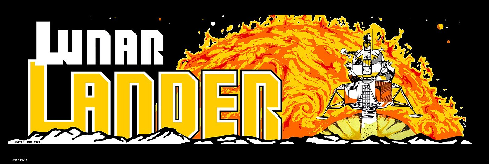

Inspiré de Lunar Lander.

Par Adame NAJI, Simon SASSI

## Dépôt officiel:

https://gitlab.univ-nantes.fr/E183694S/planet-lander-python

## Attention 

La structure du code s'inspire du jeu libre [Cabbages and king](https://github.com/Mekire/cabbages-and-kings) 
de [Mekire](https://github.com/Mekire).
Nous utilisons la même machine à état.

```

Copyright 2018, Sean J. McKiernan

Permission is hereby granted, free of charge, to any person obtaining a copy of this software and associated documentation files (the "Software"), to deal in the Software without restriction, including without limitation the rights to use, copy, modify, merge, publish, distribute, sublicense, and/or sell copies of the Software, and to permit persons to whom the Software is furnished to do so, subject to the following conditions:

The above copyright notice and this permission notice shall be included in all copies or substantial portions of the Software.

THE SOFTWARE IS PROVIDED "AS IS", WITHOUT WARRANTY OF ANY KIND, EXPRESS OR IMPLIED, INCLUDING BUT NOT LIMITED TO THE WARRANTIES OF MERCHANTABILITY, FITNESS FOR A PARTICULAR PURPOSE AND NONINFRINGEMENT. IN NO EVENT SHALL THE AUTHORS OR COPYRIGHT HOLDERS BE LIABLE FOR ANY CLAIM, DAMAGES OR OTHER LIABILITY, WHETHER IN AN ACTION OF CONTRACT, TORT OR OTHERWISE, ARISING FROM, OUT OF OR IN CONNECTION WITH THE SOFTWARE OR THE USE OR OTHER DEALINGS IN THE SOFTWARE.
```
## Instructions de jeu :

### Lancer le jeu:

Requirements:
`pygame >= 1.8.1`
`python3`

Pour lancer le jeu, faites
`python3 run_game.py`

### Démarrer le jeu en plein écran / changer la taille de la fenêtre.

Rendez vous dans [game_config.py](game_config.py) et mettez `ENABLE_FULLSCREEN` à `True`

Vous pouvez aussi modifier les variables `WINDOW_W_WINDOWED/WINDOW_H_WINDOWED`

### Contrôles du jeu:

| Commandes clavier                            | Description                                 |
|----------------------------------------------|---------------------------------------------|
| Flèche Gauche (pendant le jeu)               | Rotation du vaisseau de +2° (sur sa droite) |
| Flèche Droite (pendant le jeu)               | Rotation du vaisseau de -2° (sur sa gauche) |
| Flèche Haute/ Touche Espace (Pendant le jeu) | Activation du booster (Accélération)        |
| Touche D  (Avant le jeu)                     | Active le mode debug                        |
| Touche P(Avant le jeu)                       | Active la prediction de trajectoire         |
| Touche I (Avant le jeu)                      | Le jeu commence avec l’IA au commande       |
| Touche U/J (Avant le jeu)                    | Augmente/Diminue le nombre de plateformes   |
| Flèche Haute/Basse (Avant le jeu)            | Augmente/Diminue la quantité de fuel        |
| Touche A (Avant le jeu)                      | Active la démo                              |
| Touche Entrée                                | Lance une nouvelle partie                   |
| Touche Q                                     | Quitte le jeu (important !)                 |

## Points à améliorer

- Prendre en compte les frottements comme dans le jeu originel 

- Mettre une vitesse aléatoire au début de chaque partie (très simple)

- Rendre la map 'ronde' comme sur la lune (le joueur est retéleporté à un autre bord de l'écran)

- IA: Calculer l'essence necessaire pour aller sur une plateforme, et ansi optimiser le socre

--------------------------------------------
# Rapport:

Le rapport rendu au professeur

## Introduction

Dans le cadre du module de modélisation mathématique, nous avons développé un jeu vidéo et une intelligence artificielle capable de jouer à ce jeu. Nous avons choisi de reprendre le jeu “hit” des années 80 “Lunar Lander” sur borne arcade. Ce jeu est une “simulation” d'atterrissage sur la lune avec un seul but: poser un module lunaire.

## Comment joue t’on ?

Afin de gagner, il pose le module lunaire sur une des plusieurs plateformes disséminées dans la zone de jeu. Pour lancer une partie, il suffit d'appuyer sur la touche “entrée” du jeu, ou sinon laisser jouer l’intelligence artificielle avec la touche I. Les seules actions possibles en jeu par le joueur sont d’agir sur l'orientation du vaisseau ou d’activer le booster principal.

### Règles du jeu

  - > Il y a une quantité d’essence limitée: à chaque fois que le joueur appuie sur la touche ‘Booster’, une quantité d’essence est consommée.

  - > Il n’y a pas de possibilité de gagner de l’essence : le nombre d’unités d’essence est fixée au début de la partie, et il n’est pas possible d’en obtenir plus \! S’il n’y a plus d’essence, les moteurs s’éteignent et le module lunaire ne peut plus utiliser son booster. Ce comportement est basé sur le jeu originel, ou seul le niveau d’essence pouvait augmenter en mettant des pièces dans la borne d'arcade.

  - > Il ne faut pas arriver trop vite sur les plateformes: une vitesse horizontale supérieure à 15 ou une vitesse verticale supérieure à 20 fera exploser le module \!

  - > Il ne faut pas arriver n’importe comment sur les plateformes: un module lunaire doit atterrir perpendiculairement à la plateforme, un angle +- 10° est toléré.

  - > Si le joueur ne respecte pas une des deux règles décrites ci-dessus, son vaisseau explose à l'atterrissage et il perd alors 200 unités d’essences. La partie est perdue si l’essence atteint le niveau 0.

  - > Le niveau est régénéré aléatoirement si le joueur arrive à bien se poser.

  - > Le module lunaire a une vitesse horizontale initiale de 50 et apparaît dans le coin supérieur gauche de l’écran en début de partie.

  - > Il n’y a pas de frottements (il y en a dans le jeu originel) et toucher le bord gauche ou droit de l’écran fait exploser le module.

### Score

Chaque fois que le joueur se pose, son score augmente. Une plateforme peut multiplier le score obtenu. La détermination de ce multiplicateur est expliquée plus bas.

Le score est calculé de cette façon:

[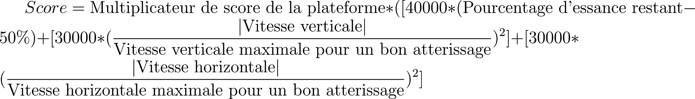](https://www.codecogs.com/eqnedit.php?latex=Score%3D%5Ctextrm%7BMultiplicateur%20de%20score%20de%20la%20plateforme%7D%20*%20\(%5B%2040000%20*%20\(%5Ctextrm%7BPourcentage%20d'essance%20restant%7D%20-%2050%5C%25\)%20%2B%5B30000%20*%20\(%5Cfrac%7B%5Cleft%7C%5Ctextrm%7BVitesse%20verticale%7D%5Cright%7C%7D%7B%20%5Ctextrm%7BVitesse%20verticale%20maximale%20pour%20un%20bon%20atterissage%7D%7D\)%5E2%5D%20%2B%20%20%5B30000%20*%20\(%5Cfrac%7B%5Cleft%7C%5Ctextrm%7BVitesse%20horizontale%7D%5Cright%7C%7D%7B%20%5Ctextrm%7BVitesse%20horizontale%20maximale%20pour%20un%20bon%20atterissage%7D%7D\)%5E2%5D%0)

La réalisation du projet est découpée en trois étapes. Premièrement la création du sol lunaire avec des plateformes d'atterrissage et une géographie aléatoire. En parallèle, le développement du comportement du module lunaire et de ses trajectoires. Enfin le développement de l’IA capable de jouer au jeu.

## Le sol de la Lune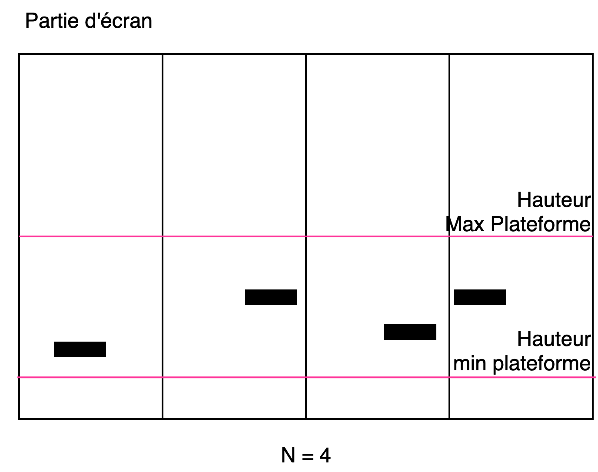

Le sol de la Lune est généré aléatoirement à chaque début de partie ou bon atterrissage. Il est composé d’un ensemble de plateformes et de points (qui forment le décor).

Une plateforme a une taille variable et une position variable. Le nombre de plateforme est déterminé manuellement avant le début de la partie. Les plateformes sont réparties dans des “zones”: pour N plateformes, l’écran est divisé en N partit. Une plateforme est ensuite positionnée aléatoirement dans sa partie d’écran, tout en respectant une contrainte de hauteur maximale.

La taille d’une plateforme est mesurée en segment de 16 px. Une plateforme fait une taille aléatoire qui peut varier de 2 à 6 segments. Son multiplicateur de point est déterminé à partir de sa taille (un tableau liste les différents multiplicateurs possibles, le premier élément du tableau est le plus haut multiplicateur, le dernier le plus bas, c’est-à-dire “x1”, on accède au tableau à partir du pourcentage de la taille maximale que la plateforme représente).

Le décor est ensuite généré entre les plateformes. L’algorithme utilisé est “l’algorithme itératif de déplacement de point central”.

Cela va permettre, à partir de deux points qui forment un segment (le point de début et le point de fin, start, end), d’une dureté (roughness), d’une limite de déplacement (limite), d’un déplacement vertical (vertical\_displacement) et d’un nombre d’itérations (number\_of\_iterations), de générer un ensemble de points.

Il fonctionne de la manière suivante:

  - > On prend le milieu d’un segment. On découpe ce segment en deux sous-segments (cela crée un nouveau point ayant pour coordonnées du milieu du segment).

  - > On décale ensuite ce point d’un déplacement vertical aléatoire (compris entre -vertical\_displacement et +vertical\_displacement. Ce déplacement vertical est limité par limit, un tuple contenant la hauteur minimale et maximale que peut prendre le point. Ce paramètre limit est utilisé pour éviter que le décor déborde en dehors de l’écran.

  - > On multiplie ensuite le déplacement vertical par:  
    > [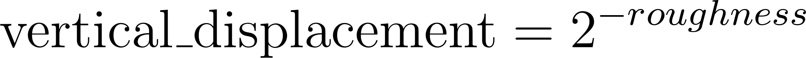](https://www.codecogs.com/eqnedit.php?latex=%5Ctextrm%7Bvertical%5C_displacement%7D%20%3D%202%5E%7B-roughness%7D%0)  
    > Cela permet de “lisser” la courbe que vont former les segments (seulement si la dureté est supérieure à 1).

  - > On répète l’opération N fois (number\_of\_iterations)

Cela va donc créer \(2^{nombre\ d'itérations}\)segments.

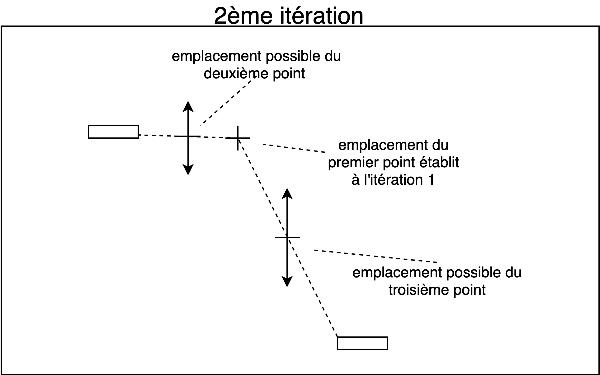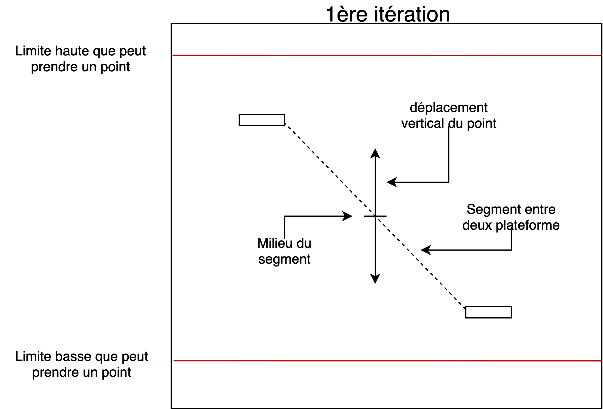

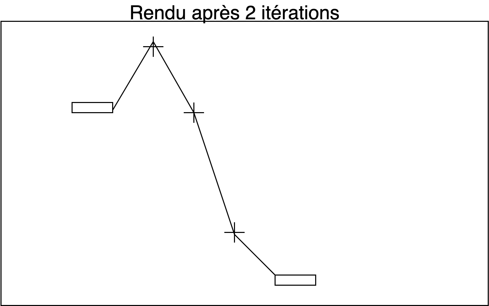

Le nombre d’itérations à effectuer pour obtenir les points entre deux plateformes est déterminé à partir du calcul suivant:

[](https://www.codecogs.com/eqnedit.php?latex=%5Ctextrm%7Bnombre%20d'iterations%7D%20%3D%20%5Clceil%7B%5Clog_2%20%20\(%5Clceil%7B%5Ctextrm%7Bespace%20x%20entre%20les%20plateformes%7D%2F%5Ctextrm%7Btaille%20des%20segments%20en%20x%7D%20%7D%20%5Crceil%7B%7D\)%7D%5Crceil%7B%7D%0)

Cela permet de garder une longueur de segment en x homogène entre les plateformes. Le déplacement vertical passé à l’algorithme est déterminé selon cette formule:

Si l’espacement en X entre les deux plateformes est inférieur à 100, alors le déplacement vertical est égal à la distance du milieu des deux plateformes et des plateformes (cela permet d’éviter d’avoir des pics entre les plateformes proches les unes des autres)

Sinon, le déplacement vertical est égal au minimum entre:

  - > la distance entre la plateforme de droite et les bords horizontaux de l’écran

  - > l’ordonnée du point qui est le milieu des deux plateformes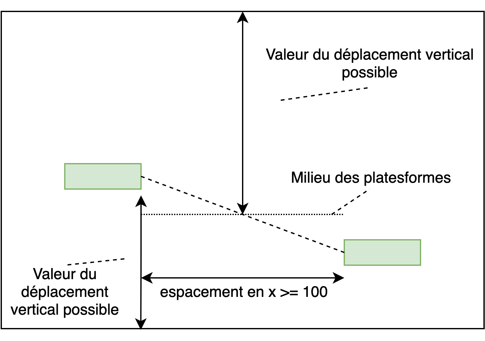

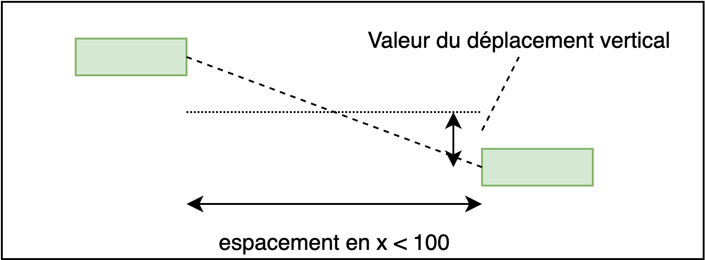

## Le module lunaire

Le module lunaire, définie par la classe Lander, est caractérisé par sa position sur l’axe des abscisses((x) et des ordonnées (y) , il nous faut également sa vitesse horizontale (vx) et la vitesse verticale (vy), pour finir on enregistre sa masse (m) et son orientation.

### Moteur physique

Pour faire avancer le vaisseau, on crée un vecteur de force basé sur l’angle du vaisseau (orientation) et une accélération (engine\_power) définie (de manière à rendre le jeu réaliste).

$`\widehat{F} = \ m*\widehat{a}\ `$

Le vecteur de force appliqué sur le vaisseau est orienté à partir de l’orientation de la façon suivante:

$`{\widehat{F}}_{\text{xengine\ }} = \ \text{mass}e_{\text{module}}\ *\ \text{engin}e_{\text{power}}\ *cos(orientation{}_{\text{module}}*\frac{\Pi}{180})\ `$

$`{\widehat{F}}_{\text{yengine}} = \ \text{mass}e_{\text{module}}\ *\ \text{engin}e_{\text{power}}\ *sin(orientation{}_{\text{module}}*\frac{\Pi}{180})`$

Ce vecteur de force n’est appliqué sur le module que lorsque le joueur active les boosters. Il est donc égal à 0 lorsque le joueur n’appuie pas sur la touche.

Le vecteur de gravité est lui appliquer constamment, c’est une accélération verticale:

$`F_{\text{ygrav}_{}} =\)\({\widehat{a}}_{gravité}*masse_{\text{module}}\ `$

L’accélération du module en x et en y est obtenue à partir de la somme de toutes les forces que subit le module:

$`{\widehat{F}}_{x} = {\widehat{F}}_{\text{xengine\ }}\ `$

$`{\widehat{F}}_{y} = {\widehat{F}}_{\text{xengine\ }} + \ F_{\text{ygrav}_{}}\ `$

On stocke les coordonnées x et y de ce vecteur (fx et fy). On utilise ces coordonnées pour définir une accélération qui sera décrite horizontalement (ax) et verticalement (ay).

On la calcule ainsi :

Comme \(\widehat{F} = \ m*\widehat{a}\ \)alors \(\widehat{a} = \frac{\widehat{F}}{m}\ \) \(\ `$

$`\widehat{a_{x}} = \frac{\widehat{F_{x}}}{m}\)\(\widehat{a_{y}} = \frac{\widehat{F_{y}}}{m}`$

Une fois l’accélération obtenue, on ajoute cette dernière à la vitesse courante via les formules suivantes : \(v_{x} = v_{\text{x\ }} + \widehat{a_{x}}*dt\) et \(v_{y} = v_{\text{y\ }} + \widehat{a_{y}}*dt`$

$`\text{dt}\) correspond au temps écoulé (ce temps est fixé dans le jeu).

La dernière étape consiste à mettre à jour les coordonnées du vaisseau y ajoutant la vitesse par rapport à un temps \(\text{dt}\) prédéfini : \(x = x + v_{x}*dt\) et \(y = y + v_{y}*dt`$

### Rotation du module et du triangle

La rotation du module utilise la fonction pygame.transform.rotate qui effectue la rotation d’une surface (image) à partir d’un point.

Cette fonction s'appuie sur une matrice de rotation:

[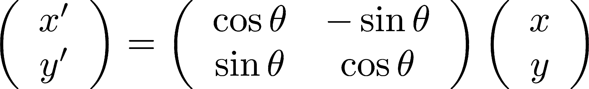](http://www.texrendr.com/?eqn=%5Cleft\(%20%5Cbegin%7Barray%7D%7Bc%7D%09x'%20%5C%5C%09y'%20%5Cend%7Barray%7D%20%5Cright\)%20%3D%09%5Cleft\(%20%5Cbegin%7Barray%7D%7Bcc%7D%09%5Ccos%7B%5Ctheta%7D%20%26%20-%5Csin%7B%5Ctheta%7D%20%5C%5C%09%5Csin%7B%5Ctheta%7D%20%26%20%5Ccos%7B%5Ctheta%7D%20%5Cend%7Barray%7D%20%5Cright\)%09%5Cleft\(%20%5Cbegin%7Barray%7D%7Bc%7D%09x%20%5C%5Cy%20%5Cend%7Barray%7D%20%5Cright\)%0)

[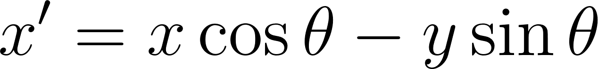](https://www.codecogs.com/eqnedit.php?latex=x'%20%3D%20x%5Ccos%7B%5Ctheta%7D%20-%20y%20%5Csin%7B%5Ctheta%7D%0)

[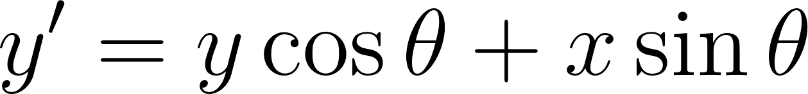](https://www.codecogs.com/eqnedit.php?latex=y'%20%3D%20y%5Ccos%7B%5Ctheta%7D%20%2B%20x%20%5Csin%7B%5Ctheta%7D%0)

ou \(\theta\)est l’angle en radian.

Ramené à la distance entre un centre et un point:

[](https://www.codecogs.com/eqnedit.php?latex=x'%20%3D%20\(x%20-%20centre_x\)%5Ccos%7B%5Ctheta%7D%20-%20\(y%20-%20centre_y\)%20%5Csin%7B%5Ctheta%7D%20%2B%20centre_x%250%0)

[](https://www.codecogs.com/eqnedit.php?latex=y'%20%3D%20%20%20\(x-center_x\)%20%5Csin%7B%5Ctheta%7D%20%2B%20\(y-center_y\)%5Ccos%7B%5Ctheta%7D%20%2B%20center_y%250%0)

Chacun des points de l’image vont être tournées tour à tour.

### Flamme du booster du module lunaire

La “flamme” du module lunaire est un triangle dont la taille grandit quand le joueur appuie sur la touche pour booster et diminue lorsque le joueur n'appuie plus. La flamme fluctue au fur et à mesure du temps. Les points du triangle, qui sont relatifs au centre du vaisseau, utilisent aussi une matrice de rotation. Afin que la transition de disparition de la flamme soit plus réelle, la hauteur du triangle diminue en fonction de la racine carrée du temps:

$`\text{hauteur}{}_{\text{triangle}} = \ hauteur{}_{\text{triangle}} -`$

### Prédiction de la trajectoire du module lunaire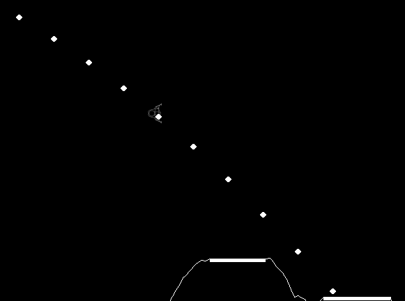

La module lunaire prédit à chaque fois la trajectoire qu’il va effectuer (à des fins visuelles et utilisé par l’intelligence artificielle).

Cette trajectoire est composée d’un ensemble de points par lesquels le centre du module va passer. Elle est déterminée à partir de la vélocité initiale et de la gravité. La trajectoire est recalculé lorsque le joueur modifie les forces du module (lorsqu’il utilise le booster). Les points de trajectoire sont obtenues en augmentant le temps passé \(\text{dt}\) à chaque fois:

$`x\  = \ v_{\text{x\ module}}*dt + x_{\text{module}}`$

$`y = \frac{1}{2}*gravité\ *\ (dt²)\  + \ v_{\text{y\ module}_{}}*dt\  + y_{\text{module}}`$

La formule \(\frac{1}{2}*gravité\ *\ (dt²)\) est une simple intégration de l’accélération.

Par la même occasion, un masque qui suit les segments formés par ces points est créé (cela est utilisé par l’intelligence artificielle afin de déterminer s’il va y avoir une collision avec une montagne du terrain avant l’atteinte d’une plateforme, voir le texte ci-dessous sur la détection des collisions).

## Détection des collisions

Toutes les collisions sont réalisées à partir des “masques” intégrés à pygame. Ces masques, qui font la taille d’une surface (une surface est une image sur laquelle on va dessiner, par exemple l’écran en est une), sont composés d’une matrice de booléen. Cette matrice de booléen est déterminé à partir des pixels de la surface qui sont opaques (si leur opacité est au-dessus d’un certain seuil). Ces masques permettent de détecter des collisions aux pixels prêts. Un masque est appliqué sur le module lunaire, le sol de la lune et les plateformes. Les masques sont comparés à chaque mise à jour du jeu (à chaque tour de boucle) bit à bit de façon diagonale\[1\] afin de déterminer s’il y a collision ou non.

## L’intelligence artificielle 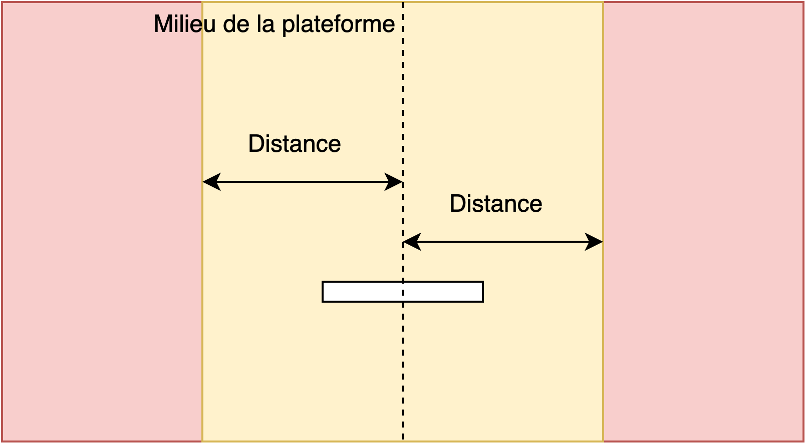

L’intelligence artificiel n’envoie que des entrées claviers. Elle n’agit pas sur les éléments du jeu. Elle a accès à la configuration du sol de la lune, l’état du module, notamment sa vitesse, sa trajectoire, son orientation etc.

### Artificial Intelligence 1 (atterrissage vertical)

La première IA fonctionne en apprenant de ses erreurs. Elle découpe la fenêtre de jeu en 3 parties. Lorsque le rover est dans la partie rouge à gauche, il est maintenu à une hauteur minimale de 550. Dans le cas où le vaisseau tombe en dessous de cette altitude, il doit s’orienter vers le haut et effectuer une poussé jusqu'à avoir une altitude supérieure à 550 et une vitesse vy de -10 (donc +10 vers le haut). Lorsque le rover est dans la partie rouge à droite, il devient impossible pour lui d’atteindre la plateforme et va donc se laisser tomber sur la surface de la Lune. Enfin lorsque le vaisseau se trouve dans la zone jaune, il est en phase de décélération. Cette zone est délimitée par une variable distance et c’est cette variable que l’IA modifie pour finir une partie.

Lorsque que le vaisseau est en phase de décélération, l’IA oriente le moteur dans la direction opposé à la vitesse horizontale et accélère jusqu’à avoir une vitesse vx de 0. Le vaisseau va alors se laisser tomber vers le bas en maintenant une vitesse inférieure à la vitesse maximale autorisée pour atterrir. L’IA ne sait pas si le vaisseau est bien au-dessus de la plateforme, mais elle va quand même tenter de poser le vaisseau.

L’IA va ensuite entrer dans une phase de recherche de la distance idéale pour décélérer via un algorithme de recherche dichotomique. Si le vaisseau atterrit à droite de la plateforme, cela signifie que la distance était insuffisante pour décélérer donc on la multiplie par 1.5. Dans le cas où le vaisseau est à gauche, cela signifie que la distance était trop grande et on la divise par deux. Au fur et à mesure des échecs on augmente la précision de l’IA. 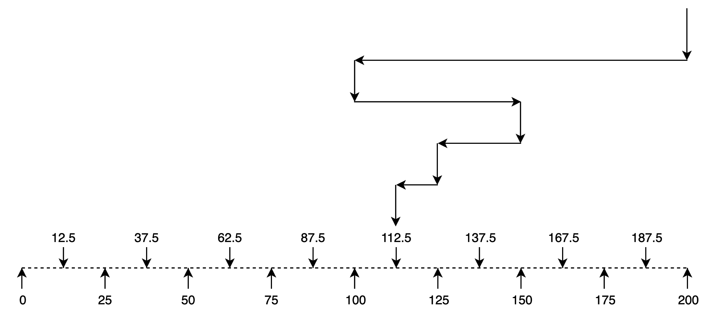

### Artificial Intelligence 2 (atterrissage vertical parfait)

La seconde IA est plus complète que la première avec un fonctionnement mathématique totalement différent, en plus des exigences de la première IA, on rajoute le fait d’économiser le carburant. On effectue les poussées strictement nécessaire pour mettre le module lunaire au-dessus de la plateforme ayant le plus haut multiplicateur de score. L’IA va donc faire en sorte d’avoir une vélocité horizontale de 0 au-dessus de la plateforme, et déterminer la distance minimale à partir de laquelle il faut activer la pousse inverse. Elle va ensuite se laisser tomber, puis effectuer la même chose verticalement: elle va déterminer à partir de quand il va falloir activer le booster pour réaliser un atterrissage parfait. Elle va aussi effectuer une poussée verticale pour éviter les montagnes qui se situeraient devant la plateforme visée.

La distance minimale à partir de laquelle activer la “poussée inverse” (le module est orienté à -180° afin d’annuler sa vélocité horizontale) est déterminé à partir de la formule suivante:

$`\text{distanc}e_{\text{minimal}} = \frac{v_{x}²}{2*a}`$

ou \(v_{x}\)est la vitesse horizontale du module et \(a\)est l’accélération du module (égale à engine\_power)

Lorsque le module se trouve au-dessus de la plateforme, il s’oriente à 90° afin d’être dans son axe. La distance minimum à partir de laquelle activer le booster est calculée en “prédisant le futur”:

En augmentant \(\text{dt}\)avec un petit pas à chaque fois, on obtient la vitesse verticale et la distance verticale parcourue à chaque instant.

$`v_{y} = v_{\text{y\ module}} + \ g\ *dt`$

$`d_{y} = 0.5\ *\ g\ *\ i²\  + \ v_{\text{y\ module}}\ *\ dt`$

A chaque futur instant, on peut ainsi calculer la distance minimale nécessaire à partir de la vitesse à l’instant:

$`\text{distanc}e_{\text{minimal}} = \frac{v_{y}²}{2*a}\)ou \(a = engine_{\text{power}} - g`$

Si cette distance minimale est trop grande (qu’elle dépasse la plateforme, c’est à cet instant que l’on doit activer le booster).

L’IA évite les montagnes en effectuant une poussée au début de la partie, tant que la trajectoire du module est en collision avec la montagne (en utilisant le masque de la trajectoire).

1.  Source: [<span class="underline">bitmap.c</span>](https://github.com/pygame/pygame/blob/7032b24af96c31e9eea9a48af7207cc12c6b7156/src_c/bitmask.c#L252) du dépôt officiel de pygame